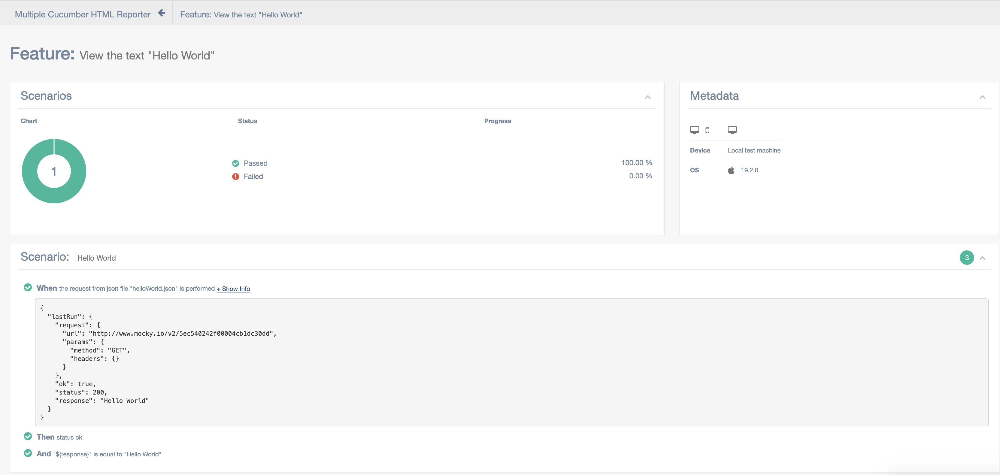

# MAF - Modular Automation Framework

An expandable, fast, easy to use automation framework built in the cucumber language.  Supports API Testing and SQL Testing in a simple manner.  Allows the usage of modules in isolation as well as in an integrated fashion.  Utilizes the cucumber language to clearly articulate intent while preserving test data for further debugging and record-keeping.  Allows the integration of custom modules and provides a core to allow for simple integration between components.  
You can view an example report at:
<https://maf-test-reports.web.app/>

[![npm package][npm-image]][npm-url]
[](https://github.com/hpcc-systems/MAF/actions/workflows/Test.yml)
[](https://david-dm.org/hpcc-systems/MAF)

## Installation

Dependencies

- node

Create a new npm project using `npm init` and install the following dependencies:

```bash
npm i @cucumber/cucumber --save-dev
npm i @ln-maf/aws --save-dev
npm i @ln-maf/validations --save-dev
npm i @ln-maf/api --save-dev
npm i @ln-maf/mysql --save-dev
npm i @ln-maf/core --save-dev
npm i multiple-cucumber-html-reporter --save-dev
```

Then create a features directory `mkdir features` with the following in `features/steps.js` file:

```JavaScript
require('@ln-maf/core/parameter_types')
require('@ln-maf/aws')
require('@ln-maf/validations')
require('@ln-maf/api')
require('@ln-maf/mysql')
```

Doing this indicates that these modules steps and [parameter types](https://cucumber.io/docs/cucumber/cucumber-expressions/#parameter-types) are available to use by cucumber.

Modify the `package.json` to use cucumber:

```JavaScript
  "scripts": {
    "test": "cucumber-js -f json:test/report/report.json $EXTRAS"
  },
```

Please also create a directory to store your test results in the root of your project.  To match the above and the below multiReport please run:

```bash
mkdir -p test/report
```

Now, when you run `npm t` it will run the tests and you can run `npx report` to get an html report of your test cases.

## Important Concepts

### Items

MAF stores information as items. Items are stored in a global object called `results`. This allows for easy access to information across steps.
For Example:

```feature
When set "name" to "John"
```

Now there is an item called "name" that has the string value of "John" and can be accessed in other steps. We can validate that the name is "John" by doing the following:

```feature
Then item "name" is equal to "John"
```

Or

```feature
Then "${name} Doe" is equal to "John Doe"
```

The first example uses a [{jsonObject}](packages/validations/JSONObject.md) to infer the item. The second example is using a template literal to access the global `results` variable to access the value of the item. Both of these stepdefiniotions are provided by the [validations](packages/validations/README.md) module, and would pass testing.

### JavaScript Injection

It is possible to quickly inline JavaScript code in the feature files. This removes the need to create full step definitions for common functions scripts

```feature
# If today was January 16, 2024
When set "currentDate" to "${moment().format('YYYY-MM-DD')}"
Then item "currentDate" is equal to "2024-01-16"
```

Not all JavaScript should be inlined. Only simple functions that do not require any external dependencies should be considered. Luxon will also be available in the core module (moment is deprecated), so it is possible to use Luxon functions in the feature files.

### Hello World API Example

`./features/HelloWorldAPI.feature`

```JavaScript
Feature: View the text "Hello World"
  Scenario: Hello World
    When perform api request:
    """
    {
      "url": "http://www.mocky.io/v2/",
      "api": "5ec540242f00004cb1dc30dd",
      "method": "GET"
    }
    """
    Then status ok
    And item "response" is equal to "Hello World"
```

### The Generated report

```bash
➜  mafMonoRepo git:(master) bash runFeature.sh helloWorld.feature
...

1 scenario (1 passed)
3 steps (3 passed)
0m00.360s


=====================================================================================
    Multiple Cucumber HTML report generated in:

    $HOME/mafMonoRepo/test/report/index.html
=====================================================================================
```



### Hello World MYSQL Example

This requires the setup of your sql environment.  To utilize this, please run `npx mysql-configure` after installing `npm i @ln-maf/mysql`  and it will prompt you for needed credentials, etc. for SQL to run properly.    It will store the config in a `sqlConfig.json` file and it will store your credentials using `node-keytar` which uses your OS's secure password storage:

- Windows - Credential Vault
- MacOS - KeyChain
- Linux - libSecret

You will also need to update the sql query and update the validations to match.  You can copy the validations from the generated report to make sure it passes.

`features/HelloWorldSQL.feature`

```JavaScript
Feature: SQL Hello World
  Scenario: Run a query
      When mysql query from string "SELECT * FROM HelloWorld" is run
      Then it matches set from the file "helloWorldSQL.json"
```

`./helloWorldSQL.json`

```JavaScript
[
  {
    "id" : "1",
    "hello": "world"
  },
  {
    "id" : "2",
    "hello": "day"
  }
]
```

`Table HelloWorld`

```JavaScript
| id | hello |
| 1  | world |
| 2  | day   |
```

## Included modules

There are several included modules, below are links to the READMEs.  You can also find them in the projects directory.

[Validations](packages/validations/README.md) - This project contains helper cucumber steps and various ways of setting objects.  It additionally performs validations on some of the objects.  This would include things like `Then item "a" is equal to 5` and `When "Hello World" is base64 encoded`

[AWS](packages/aws/README.md) - This project contains cucumber steps to run calls on AWS (Amazon Web Services). Supported features include S3, DynamoDB, SQS.

[API](packages/api/README.md) - This project contains cucumber steps for performing API Calls.

[MySQL](packages/mysql/README.md) - This project contains cucumber steps for calling MYSQL.

[DefaultSql](packages/defaultSQL/README.md) - This project is used to create other sql modules.  Just implement what is in MySQL and read the README to get it set up.

[Preprocessor](packages/preprocessor/README.md) - This contains details about the preprocessor.  It is used to add information in feature files and runs before the feature file would.

[Core](packages/core/README.md) - This contains details about the core.  If you are attempting to set up your own cucumber steps it is a good place to start.  Specifically for the function `MAFWhen`.  Additionally discusses the parsing of how template literals is done; which is needed to provide easy access to variables within strings.

Variables can be used within almost any step.  These can be used as follows:

Feature: Variable example with api

`./features/HelloWorldAPI.feature`

```JavaScript
Feature: View the text "Hello World"
  Scenario: Hello World
    Given set "url" to "https://mocky.io/v2/"
    Given set "exampleLiteral" to "${5+5}Works?"
    When api request from file "helloWorld.json" is performed
    Then status ok
    And "${response}" is equal to "Hello World"
```

`./helloWorld.json`

```JavaScript
{
  "url": "${url}",
  "api": "5ec540242f00004cb1dc30dd",
  "method": "GET"
}
```

## Developer Notes

### Adding a module

Please view [AddModule](./AddModule.md) for information on how to add a module.  This will allow the creation of new steps that can be used in your project.

[npm-image]:https://img.shields.io/npm/v/@ln-maf/core.svg
[npm-url]:https://www.npmjs.com/search?q=ln-maf

### Testing the modules

Running the tests for the modules is done using the `npm test -w packages/PACKAGE_NAME` command. Set PACKAGE_NAME to the name of the package you want to test. eg. `npm test -w packages/api`.

### Running localstack

All the modules can be tested locally without any external dependencies, except for the AWS module. To test AWS locally, you can use a [localstack](https://github.com/localstack/localstack) docker container. The version used as of now is 4.6.0.

To run localstack locally in a docker container, you can use the following command:

```bash
docker run --rm -it -p 4566:4566 localstack/localstack:4.6.0
```

Command explanation:

- --rm: remove the container after it stops
- -it: interactive mode, so the container logs are shown in the terminal
- -p 4566:4566: expose the port 4566 of the container to the port 4566 of the host
- localstack/localstack:3.0.2: the image to use and version

Then you can initialize, or reinitialize the services in localstack using the `initLocalstack.tf` file when testing:

```bash
terraform destroy -auto-approve && terraform apply -auto-approve  
```
